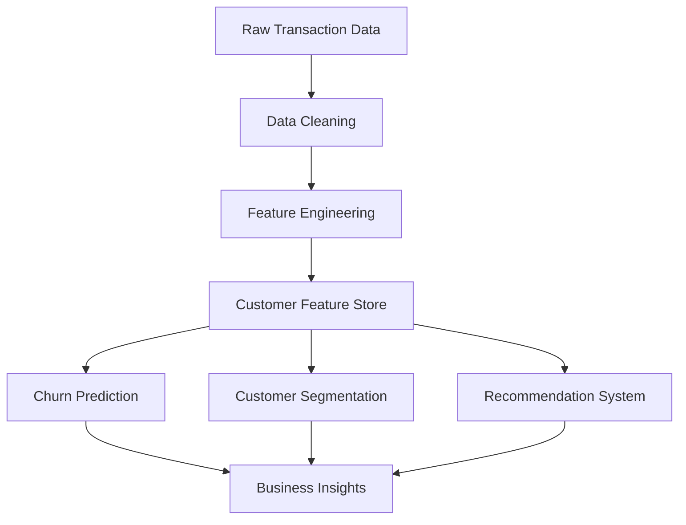
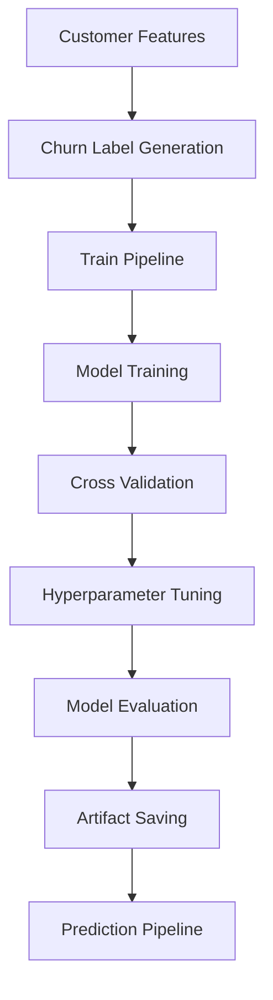
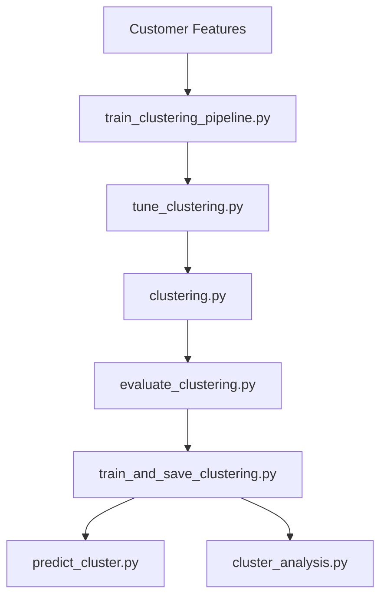

# CartIQ - E-Commerce Intelligence System

CartIQ is a production-style machine learning system for customer intelligence in e-commerce.

Using transactional purchase data, the system provides:

- Customer Churn Prediction
- Customer Segmentation
- Recommendation Systems
- Revenue Intelligence
- Explainable Business Insights

The project is built using the Online Retail dataset from the UCI Machine Learning Repository.

---

# Dataset

Dataset Link:

https://archive.ics.uci.edu/dataset/352/online+retail

Place the dataset as:

```text
data/raw/online_retail.xlsx
```

---

# Project Architecture



---

# Feature Engineering

Customer-level features are generated from transaction history.

## RFM Features

- Recency
- Frequency
- Monetary

## Behavioral Features

- AvgItemsPerOrder
- AvgUniqueProductsPerOrder

## Product Features

- UniqueProducts

## Value Features

- AvgValueSpend
- AvgOrderValue
- MonthlySpendStd
- StdOrderValue

## Temporal Features

- CustomerTenure
- LastPurchaseDate

## Trend Features

- RecentSpend
- OldSpend
- SpendGrowthRate

---

# Churn Prediction System

## Pipeline



## Models

- Logistic Regression
- Random Forest
- XGBoost

## Evaluation Metrics

- Accuracy
- Precision
- Recall
- F1 Score
- ROC-AUC
- Confusion Matrix

## Status

✅ Completed

---

# Customer Segmentation System

## Clustering Features

- Recency
- Frequency
- Monetary
- CustomerTenure
- UniqueProducts
- SpendGrowthRate

## Pipeline



## Candidate Algorithms

- KMeans
- Agglomerative Clustering
- Gaussian Mixture Models

## Status

🚧 In Progress

Completed:

- Clustering feature selection
- Clustering training pipeline

---

# Repository Structure

```text
src/

├── data/
├── features/
├── models/
├── pipeline/
├── targets/
├── recommender/
├── explainability/
└── utils/

artifacts/
data/
reports/
notebooks/
tests/
```

---

# Current Progress

## Completed

- Data Cleaning
- Exploratory Data Analysis
- Feature Engineering
- Churn Label Creation
- Classification Pipeline
- Cross Validation
- Hyperparameter Tuning
- Model Evaluation
- Artifact Management
- Prediction Pipeline

## In Progress

- Customer Segmentation (Clustering)

## Planned

- Recommendation Engine
- Revenue Forecasting
- FastAPI Backend
- Streamlit Dashboard
- Docker Deployment

---

# Tech Stack

## Data Processing

- Pandas
- NumPy

## Machine Learning

- Scikit-Learn
- XGBoost

## Deep Learning

- PyTorch

## Visualization

- Matplotlib
- Seaborn

## Deployment

- FastAPI
- Streamlit

---

# Future Roadmap

## Phase 1

- ✅ Churn Prediction
- 🚧 Customer Segmentation
- ⏳ Recommendation System

## Phase 2

- Revenue Forecasting
- Customer Lifetime Value Modeling
- Business Intelligence Dashboard

## Phase 3

- Neural Collaborative Filtering
- Deep Learning Forecasting Models
- Advanced Customer Representation Learning

---

# License

This project is licensed under the MIT License.
