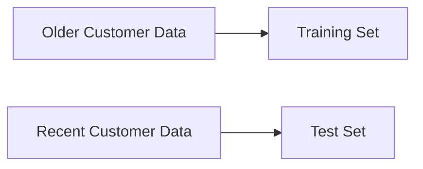
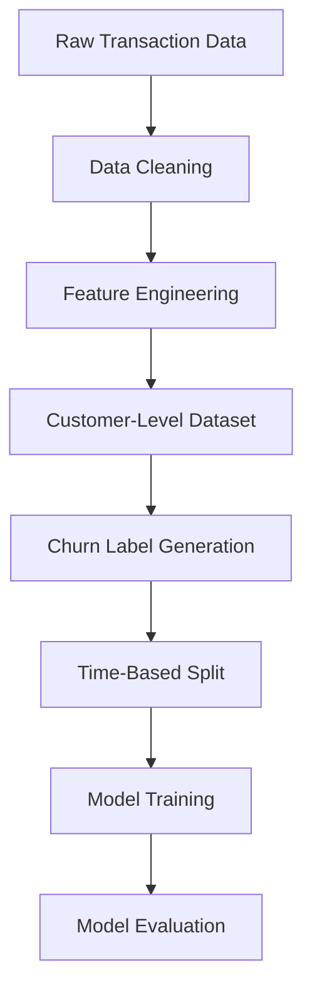

# CartIQ — E-Commerce Intelligence System

An end-to-end machine learning system for analyzing customer behavior in e-commerce platforms using customer analytics, churn prediction, and recommendation systems.

---

## Problem Statement

E-commerce platforms struggle to understand customer behavior at scale:

- Which customers are likely to purchase?
- Which customers are at risk of churn?
- How much will a customer spend?
- What products should be recommended?

CartIQ combines multiple machine learning workflows into a unified customer intelligence system.

---

## Dataset

This project uses the Online Retail dataset from the UCI Machine Learning Repository.

Dataset Link:  
https://archive.ics.uci.edu/dataset/352/online+retail

---

## Dataset Setup

1. Download the dataset from the link above

2. Rename the file to:

```text
online_retail.xlsx
```

3. Place the file inside:

```text
data/raw/
```

Final structure:

```text
data/
└── raw/
    └── online_retail.xlsx
```

---

## Current Scope

The current implementation includes:

- Data loading pipeline
- Data cleaning pipeline
- Exploratory Data Analysis (EDA)
- Customer-level feature engineering
- Churn target generation
- Time-based train/test splitting
- Classification model training
- Evaluation pipeline

---

## Exploratory Data Analysis (EDA)

Performed analysis on:

- Revenue distribution
- Customer purchase frequency
- Basket size
- Monthly activity trends
- Recency distribution
- Churn threshold analysis

---

## Feature Engineering

### RFM Features
- Recency
- Frequency
- Monetary
- LastPurchaseDate

### Behavioral Features
- AvgOrderValue
- AvgItemsPerOrder
- StdOrderValue

### Value Features
- AvgMonthlySpend
- MonthlySpendStd

### Product Features
- Product diversity metrics
- Unique purchasing behavior

### Temporal Features
- Activity timeline features

### Trend Features
- Spending trend behavior

---

## Churn Classification

Customers inactive for more than **60 days** are labeled as churned based on recency distribution analysis.

---

## Time-Based Splitting

Chronological train/test splitting is used instead of random splitting to reduce temporal leakage.



---

## Models Implemented

- Logistic Regression
- Random Forest
- XGBoost

---

## Evaluation Metrics

- Accuracy
- Precision
- Recall
- F1 Score
- ROC-AUC
- Confusion Matrix

---

## Current Pipeline



---

## Repository Structure

```text
src/
├── data/           # data loading + cleaning
├── features/       # feature engineering
├── targets/        # churn labeling
├── models/         # training + evaluation
├── pipeline/       # orchestration pipelines
├── recommender/    # recommendation modules
└── utils/          # helper utilities
```

---

## Running the Project

### Build Processed Dataset

```bash
uv run python -m src.pipeline.build_processed_dataset
```

### Run Classification Pipeline

```bash
uv run python -m src.pipeline.train_pipeline
```

---

## Project Status

### Completed
- [x] Data cleaning
- [x] EDA
- [x] Feature engineering
- [x] Churn labeling
- [x] Time-based splitting
- [x] Baseline classification models
- [x] Evaluation pipeline

### Planned
- [ ] Cross-validation
- [ ] Hyperparameter tuning
- [ ] Regression pipeline
- [ ] Clustering pipeline
- [ ] Recommendation system
- [ ] FastAPI deployment
- [ ] Streamlit dashboard

---

## Tech Stack

- Python
- Pandas
- NumPy
- Scikit-learn
- XGBoost
- Matplotlib
- Jupyter Notebook
- FastAPI *(planned)*
- Streamlit *(planned)*

---

## License

This project is licensed under the MIT License.
